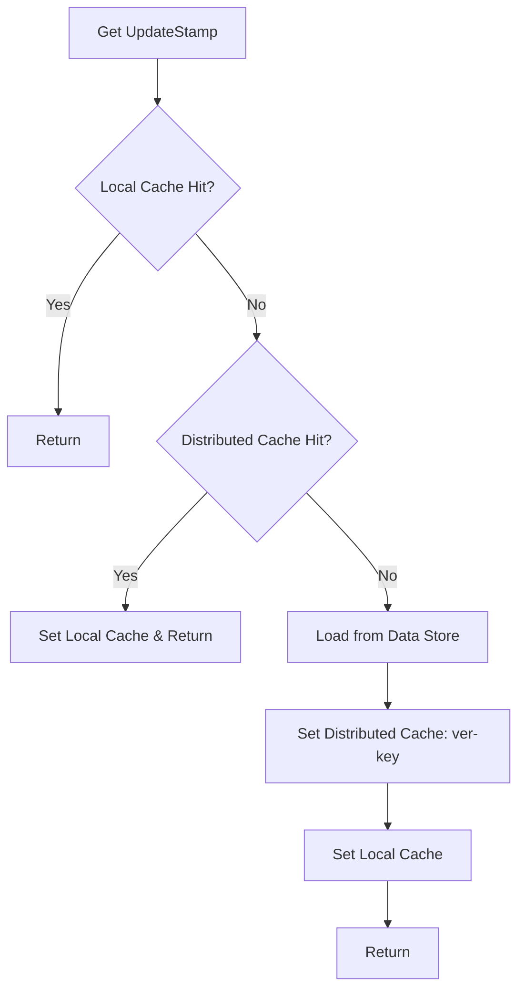

# 项目 stamp 缓存策略与一致性保障设计

本文系统阐述一种基于“更新戳（stamp/version）”的缓存策略与一致性保障方案。设计目标是：在高并发读写场景中，提供低延迟读性能，同时保证最终一致性与可观测性，并具备良好的降级能力。

核心思想：
- 将数据更新以“更新戳（update stamp/version）”进行版本化管理
- 缓存层按“容器类型 + 资源标识 + 数据类型 + 更新戳”的版本化 key 命名
- 读侧通过版本化 key 实现“读后写一致”和“无需显式失效”的轻量一致性策略
- 写侧采用单点原子更新戳与轻量缓存失效/旁路策略

目录
- 缓存策略设计
- 一致性保障方案
- 性能优化措施
- 监控与告警
- 总结

---

## 一、缓存策略设计

### 1.1 分层架构

缓存建议采用“本地 + 分布式 + 源存储”三层架构：

```mermaid
graph TD
    A[Client / API] --> B[Local Cache (in-process LRU)]
    B -->|miss| C[Distributed Cache (e.g. Redis)]
    C -->|miss| D[Data Store (DB/Index)]
    D -->|load & stamp| C
    C -->|versioned key| B
```

- 本地缓存（Local Cache）：进程内 LRU 或 ARC，极低延迟与最小网络开销，用于热点读与短生命周期数据。
- 分布式缓存（Distributed Cache）：例如 Redis/Memcached，承担跨节点共享缓存，存储“版本化 key ➜ 数据”的条目。
- 源存储（Data Store）：业务源数据（数据库/索引），作为最终一致性的权威来源；同时提供“更新戳（update stamp/version）”的生成与持久化。

### 1.2 版本化缓存 key 设计

缓存 key 需保证“读后写一致”，避免显式失效的复杂度。推荐命名规范：


- containerType：容器类型（如 team/project/org/component 等）
- containerUUID：容器唯一标识（UUID/ID）
- stampType：数据类型枚举（如 task_stats、issuetype、transition、field_config 等）
- updateStamp：由源存储维护的“单调递增版本号/时间戳”，每次数据变更时都会递增

命名规则示例：
- team:team-123:task_stats:1695805123123
- project:proj-456:issuetype:42

这种设计有三点收益：
- 即时一致：更新后版本号变化，读侧自然“命中新 key”，无需主动失效旧值
- 并行安全：旧版本（旧 key）仍可短暂存在，避免并发争用
- 缓存复用：不同 stampType 与容器隔离，避免共享污染

### 1.3 过期机制与更新策略

- 过期（TTL）策略：
  - 分布式缓存建议配置合理 TTL（如 5 分钟到 30 分钟），避免僵尸数据长期存在
  - 本地缓存以 LRU 结合容量限制（max entries / size）优先淘汰，不强制 TTL
- 更新策略（Write-Through + Version Bump）：
  - 写侧在修改源数据后，原子更新该“容器 + 类型”的 updateStamp（版本号递增或使用单调时间戳）
  - 更新戳作为读侧 key 的“版本”输入，读侧每次请求都会先获取 updateStamp，以确保拿到最新版本数据
  - 分布式缓存采用写穿或延迟写回：先更新源存储、再设置新版本 key 的缓存值，或由读侧在 miss 时填充

---

## 二、一致性保障方案

### 2.1 数据变更时的缓存失效机制

采用“版本化 + 旁路”替代传统显式失效：
- 数据变更触发版本号递增（updateStamp bump）
- 读侧在获取数据时总是先读取当前 updateStamp（通过轻量 RPC 或本地快照）
- 使用新版本号拼接缓存 key；即使旧版本值暂存也不会被命中

必要时可对特定场景做定向失效：
- 高价值但字面非常少的键（如某唯一聚合）可直接 DEL 旧版本 key，减少存储占用
- 需要强制刷新时，允许强制旁路缓存（读源存储）

### 2.2 读写并发场景的处理

并发写入与读写一致性原则：
- 写入流程：
  1. 开启事务，更新源数据
  2. 原子更新 updateStamp（版本号递增）
  3. 提交事务后写入分布式缓存新版本 key（异步或同步）
- 读流程（并发安全）：
  1. 获取当前 updateStamp（读写竞争时优先保证最终一致）
  2. 以版本化 key 读取本地/分布式缓存
  3. 若 miss，回源读取（并设置新版本 key）

当存在多个写入同时进行：
- 版本号必须全局单调递增（使用数据库序列/行锁/乐观锁 + CAS）
- 对于晚到的缓存写入，因版本号不同不会污染新 key（旧 key 不会影响新 key）
- 通过版本化 key 避免“写回覆盖”问题

### 2.3 最终一致性的实现方式

- 版本化读侧：读侧每次依据最新 updateStamp 去读新 key，确保“读后写一致”
- 旧版本回收：TTL 到期后自动回收；也可周期性后台清理旧版本键（按容器与类型）
- 异常恢复：当分布式缓存不可用时，读侧可以直接回源并重建新版本 key；最终一致由源存储保证

---

## 三、性能优化措施

### 3.1 缓存预热策略

- 启动预热：服务启动时，预拉取核心容器的关键 stampType 的最新数据与 updateStamp，写入本地与分布式缓存
- 事件驱动预热：监听数据变更事件（如消息队列），在变更后主动生成新版本 key 与数据快照
- 定时预热：对热点容器与类型定期刷新缓存，防止 TTL 命中低谷

### 3.2 热点数据特殊处理

- 本地热点提升：对识别为热点的数据在本地缓存中设置更高的保留优先级或更大容量池
- 批量读取与拼接：对同容器多类型的读取进行合并请求，减少分布式缓存与源存储压力
- 层级聚合缓存：为热点列表类数据建立二级聚合缓存（如 summary 缓存），减少多条目并发读取

### 3.3 降级方案设计

- 读侧降级：分布式缓存不可用时，直接旁路读取源存储，并将结果插入本地缓存（短 TTL）
- 写侧降级：无法更新分布式缓存时，仅维护源存储与 updateStamp；读侧会自动通过新版本 key 命中
- 回退开关：提供动态开关，临时关闭特定 stampType 的缓存层，以便排障或应对流量峰值

---

## 四、监控与告警

### 4.1 缓存命中率监控

- 维度：
  - 本地缓存命中率（hit/miss）
  - 分布式缓存命中率（hit/miss）
  - 回源比例（source hits）
  - 按容器类型与 stampType 分布
- 指标：
  - QPS、延迟 P50/P90/P99
  - 版本键数量与增长率
  - 预热成功率与耗时

### 4.2 异常情况告警机制

- 告警项：
  - 分布式缓存不可用或超时率超过阈值
  - 版本号递增失败或出现回退（非单调）
  - 缓存穿透异常（短时源存储访问飙升）
  - 命中率骤降（可能存在热点失效或键设计问题）
- 处理动作：
  - 自动触发降级（旁路或关闭某类型缓存）
  - 自动预热尝试或重新构建版本快照
  - 标记并回收异常旧版本键

---

## 五、参考流程图

### 5.1 写入更新流程（带版本号递增）

```mermaid
flowchart TD
    A[Begin Tx] --> B[Update Data Store]
    B --> C[Increment UpdateStamp (atomic)]
    C --> D[Commit Tx]
    D --> E{Write Cache?}
    E -->|Yes| F[Set Distributed Cache: ver-key]
    E -->|No| G[Skip Cache Write]
    F --> H[Notify/Events (optional)]
    G --> H
```

关键点：
- UpdateStamp 必须在事务内原子性更新，确保提交后对读侧可见
- 分布式缓存写入可以异步，但建议有失败重试或后台补偿

### 5.2 读取流程（版本化 key）



关键点：
- 每次读取先获取“最新版本号”，避免命中旧值
- 本地缓存优先，分布式缓存次之，miss 旁路源存储

---

## 六、示例伪代码

### 6.1 版本化 Key 生成

```go
func MakeStampKey(containerType, containerID string, stampType int, updateStamp int64) string {
    // e.g. "team:team-123:task_stats:1695805123123"
    return fmt.Sprintf("%s:%s:%d:%d", containerType, containerID, stampType, updateStamp)
}
```

### 6.2 读侧封装（带预热与降级）

```go
func GetStampedValue(ctx context.Context, containerType, containerID string, stampType int) (Value, error) {
    ver, err := LoadUpdateStamp(ctx, containerType, containerID, stampType) // 从源存储或轻量分布式缓存
    if err != nil {
        // 降级：若版本号加载失败，可选择旁路或返回旧值
        return FallbackOldValue(ctx, containerType, containerID, stampType, err)
    }
    key := MakeStampKey(containerType, containerID, stampType, ver)

    if v, ok := LocalCacheGet(key); ok {
        return v, nil
    }
    if v, ok := DistributedCacheGet(key); ok {
        LocalCacheSet(key, v)
        return v, nil
    }
    // 回源
    v, err := LoadFromDataStore(ctx, containerType, containerID, stampType)
    if err != nil {
        return Value{}, err
    }
    // 写缓存（可带重试）
    DistributedCacheSet(key, v, TTLFor(stampType))
    LocalCacheSet(key, v)
    return v, nil
}
```

### 6.3 写侧封装（事务 + 版本号递增）

```go
func UpdateDataWithStamp(ctx context.Context, containerType, containerID string, stampType int, patch Patch) error {
    return WithTx(func(tx Tx) error {
        if err := ApplyPatch(tx, containerType, containerID, patch); err != nil {
            return err
        }
        if err := IncrementUpdateStamp(tx, containerType, containerID, stampType); err != nil {
            return err
        }
        return nil
    })
}
```

---

## 七、总结

- 版本化缓存 key 是读写并发下一致性与性能的关键：无需显式失效、避免写回覆盖、提供读后写一致。
- 分层缓存架构在响应延迟与稳定性之间平衡：本地缓存处理热点、分布式缓存跨节点共享、源存储提供最终一致性。
- 完整方案必须辅以监控与告警、预热与降级策略，确保在异常与高峰场景下的韧性与可恢复性。
- 通过合理的命名规范与 TTL 策略、原子的 updateStamp 管理、以及事件驱动的预热补偿，可以在复杂业务场景中实现高效、可扩展且易于维护的缓存体系。